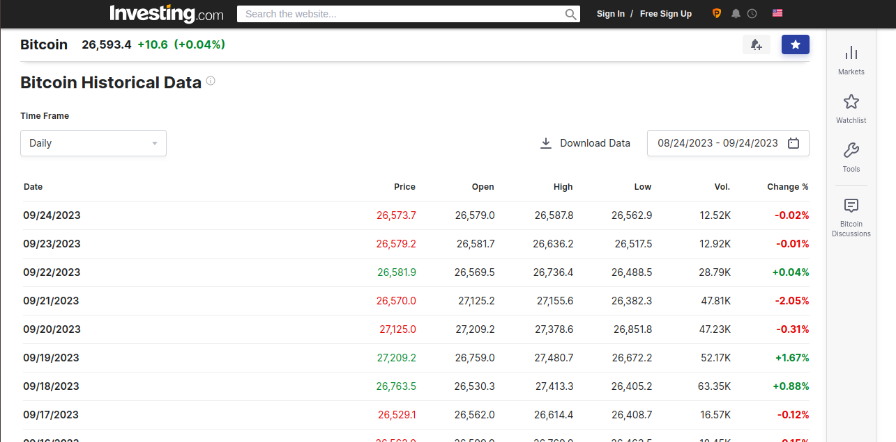
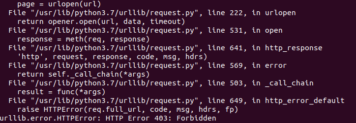
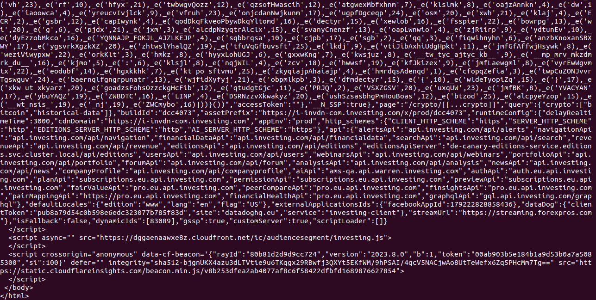

# anywebscraper

Have you ever tried to access data from a number of sites only to be blocked? The solution is often to use proxies, which may or may not work. Don't worry, **anywebscraper** is the solution to these problems.

**anywebscraper** is your ultimate web data extraction companion. We understand the challenges of web scraping, including dealing with anti-bot measures and the need for reliable proxies. Our library is designed to make web scraping easy and effective, even in the most challenging environments. Whether you're a data scientist, business analyst, or developer looking to harness the power of web data, **anywebscraper** has you covered.

## Key Features
* **No Proxy Integration**: Say goodbye to IP bans and blocked access. **anywebscraper** does not integrate with proxies but ensures uninterrupted data retrieval.

* **Universal Compatibility**: Our library can scrape data from virtually any type of website, including e-commerce platforms, social media networks, news sites, and more.

* **Customisable and Scalable**: If you're familiar with BeautifulSoup, bingo! **anywebscraper** returns a BeautifulSoup-like object and is highly customizable to meet your specific scraping needs.

* **Reliable Support**: Count on our dedicated support team to assist you with any questions or issues you encounter.

## Usage
```bash
pip install anywebscraper
```

```python
from anywebscraper.anywebscraper import AnyWebScraper

# Initialization
webscraper = AnyWebScraper()

# Define the url of the website you want to web scrape
url="your-website URL" # i.e url = "https://google.com"
soup = webscraper.webScrape(url=url) # Returns 'BeautifulSoup' object
soup.find("your-html-element", class_="your-class")
```
Note that all BeautifulSoup methods can be applied to soup that our library returns: ```.prettify(), .find(), .find_all(), .get_text(), etc.```

## Example
Let's try to collect historical bitcoin data from https://www.investing.com using the classic method, as shown in this image:



To do that, we can use Python code below:
```
from urllib.request import urlopen

url = "https://www.investing.com/crypto/bitcoin"
page = urlopen(url)
html_bytes = page.read()
html = html_bytes.decode("utf-8")
print(html)
```
An error is displayed stating that it is forbidden to request this link, as shown in this image. 


Now let's use **anywebscraper** to see the difference.
```
from anywebscraper.anywebscraper import AnyWebScraper

url = "https://www.investing.com/crypto/bitcoin"
web_scraper = AnyWebScraper()
html = web_scraper.webScrape(url=url)
print(html.prettify())
```


We can see that there is no forbidden error and that our library returns data from this link. Now all we need to do is collect the relevant data, as we do with BeautifulSoup, using the appropriate methods.

## Contribution

Pull requests are welcome. For significant changes, please open an issue first to discuss what you want to change.
